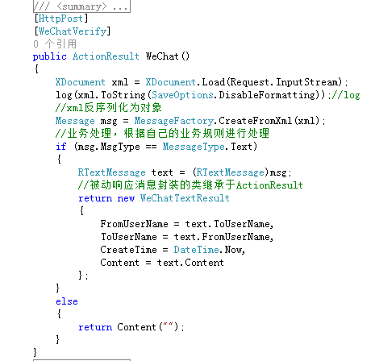
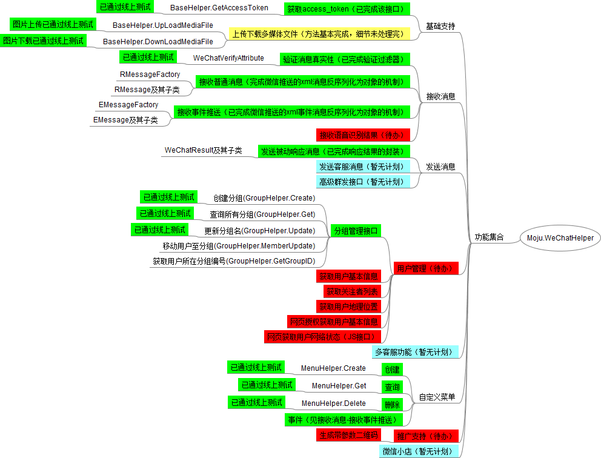

Moju.WeChatHelper
=================

微信公众平台接口开发包

 
###用例介绍

###配置方式（微信appid，appsecret，token）

		<configSections>
		 <section name="WeChatHelperSection" type="Moju.WeChatHelper.WeChatHelperSection, Moju.WeChatHelper, Version=1.0.0.0, Culture=neutral, PublicKeyToken=null" />
		</configSections>
		<WeChatHelperSection WeChatAppID="" WeChatAppSecret="" Token="" />
 
###开发思路，思维导图

###命名空间说明
无视目录结构，所有类处于同一命名空间Moju.WeChatHelper下
###开发环境说明
vs2013
.net framework 4.0
asp.net mvc4